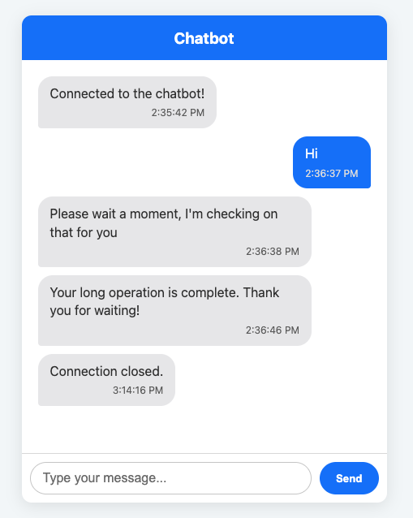

# Real-Time Streaming Dialogflow CX Chatbot

This repository contains the source code for a fully functional, real-time chatbot using Node.js and the Dialogflow CX streaming API. It's designed to provide instant, partial responses to the user, creating a more engaging and human-like conversational experience.

This project is a direct solution to the common issue of high latency in chatbots, which can lead to poor user engagement and abandonment. By streaming responses, we give the user immediate feedback that their query is being processed.

## Features

- **Real-Time Responses:** Leverages WebSockets and the Dialogflow CX `streamingDetectIntent` API.
- **Engaging UI:** A clean, modern chat interface that distinguishes between user and bot messages and includes timestamps.
- **Simple Backend:** A lightweight Node.js Express server.
- **Easy to Deploy:** Can be run locally or easily adapted for cloud deployment.
- **Scalable:** The "request-per-message" stream handling is robust and avoids state management issues.

## Prerequisites

- [Node.js](https://nodejs.org/) (v16 or later recommended)
- A Google Cloud Platform Project
- A Dialogflow CX Agent already created
- [Google Cloud SDK](https://cloud.google.com/sdk/docs/install) (`gcloud` CLI) installed and authenticated.

## Setup and Installation

1.  **Clone the Repository**
    ```bash
    git clone [https://github.com/YOUR_USERNAME/dialogflow-cx-streaming-chatbot.git](https://github.com/YOUR_USERNAME/dialogflow-cx-streaming-chatbot.git)
    cd dialogflow-cx-streaming-chatbot
    ```

2.  **Install Dependencies**
    ```bash
    npm install
    ```

3.  **Configure `server.js`**
    Open `server.js` and update the configuration section with your specific Google Cloud and Dialogflow CX details:
    ```javascript
    // --- 1. Configuration ---
    const projectId = 'your-gcp-project-id';
    const location = 'your-agent-location'; // e.g., 'global' or 'us-central1'
    const agentId = 'your-dialogflow-agent-id';
    ```

4.  **Set Up Authentication**
    For local development, the easiest way to authenticate is using Application Default Credentials (ADC). Run the following command in your terminal and follow the prompts:
    ```bash
    gcloud auth application-default login
    ```
    Ensure the authenticated user has the **"Dialogflow API User"** role in your GCP project's IAM settings.

5.  **Run the Application**
    ```bash
    npm start
    ```
    Open your browser to [http://localhost:3000](http://localhost:3000) to see the chatbot in action!

    5.  **Demo**

